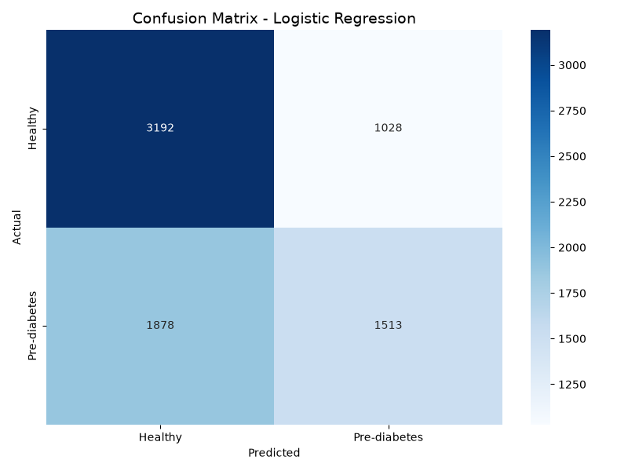
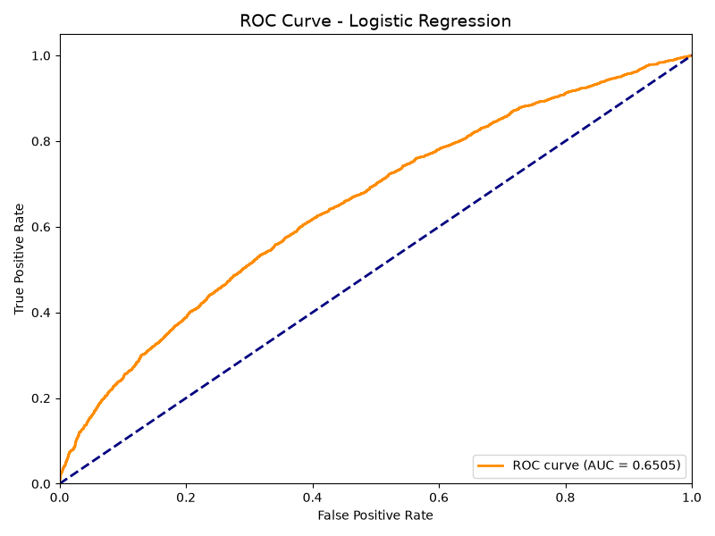
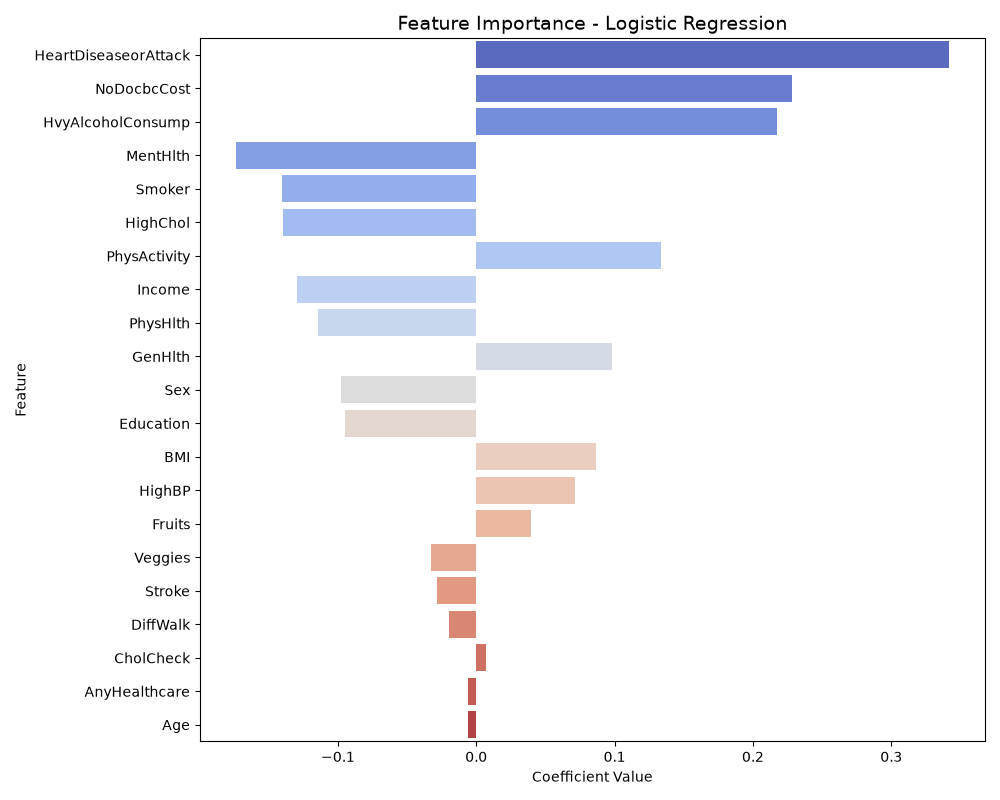

# Health Data Analysis — CDC Diabetes Health Indicators

## Project Description
End-to-end data analysis and machine learning project on diabetes health indicators using the CDC Behavioral Risk Factor Surveillance System (BRFSS) dataset. This project covers exploratory data analysis (EDA), visualization, and predictive modeling with Logistic Regression.

## Objectives
- Work with real-world health data
- Perform exploratory data analysis (EDA) with Python
- Build a machine learning model for diabetes prediction
- Create analytical visualizations
- Prepare a foundation for advanced health data projects

## Dataset
- **Source:** CDC Diabetes Health Indicators (Hugging Face)
- **Rows:** 38,052
- **Columns:** 23
- **Key variables:** Age, BMI, HighBP, HighChol, Smoker, Stroke, HeartDiseaseorAttack, PhysActivity, Diabetes_012, target

## Tools & Libraries
- Python 3.13
- pandas
- numpy
- matplotlib
- seaborn
- scikit-learn
- pyarrow

## Project Structure

- `EXPLORE.PY` — Exploratory Data Analysis
- `MODEL.PY` — Machine Learning Model
- `test.parquet` — Test dataset
- `train.parquet` — Training dataset
- `age_distribution.png`
- `diabetes_distribution.png`
- `bmi_diabetes.png`
- `correlation_matrix.png`
- `confusion_matrix.png`
- `roc_curve.png`
- `feature_importance.png`
- `README.md`

## Exploratory Data Analysis

### Age Distribution


### Diabetes Distribution


### BMI vs Diabetes


### Correlation Matrix


## Machine Learning Model

### Model: Logistic Regression
- **Train/Test Split:** 80% / 20%
- **Feature Scaling:** StandardScaler
- **Evaluation Metrics:** Accuracy, Precision, Recall, F1-Score, ROC-AUC

### Confusion Matrix


### ROC Curve


### Feature Importance


## How to Run

1. Install Python 3.13

2. Install required libraries:
```bash
pip install pandas numpy matplotlib seaborn scikit-learn pyarrow
