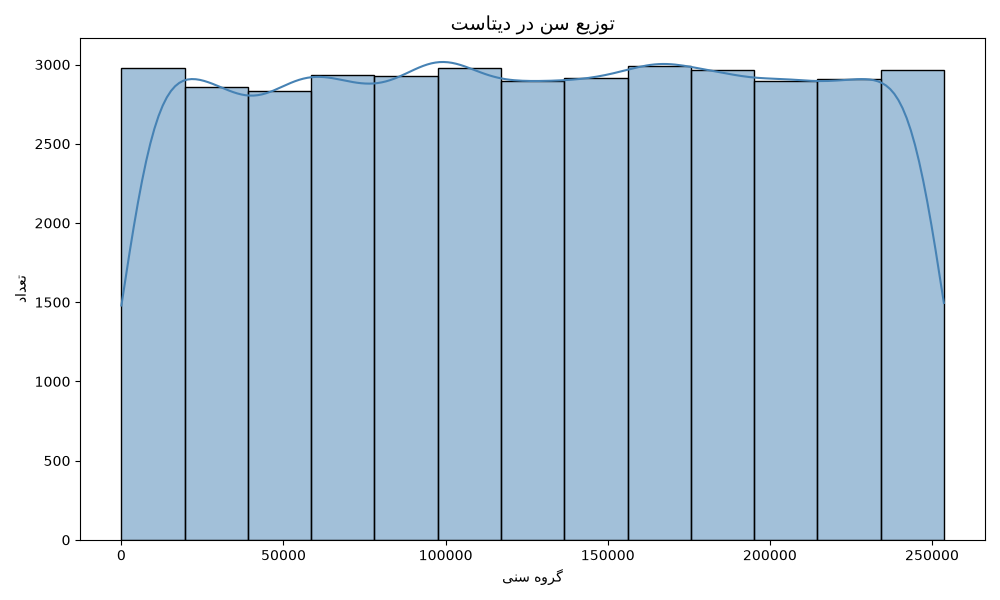
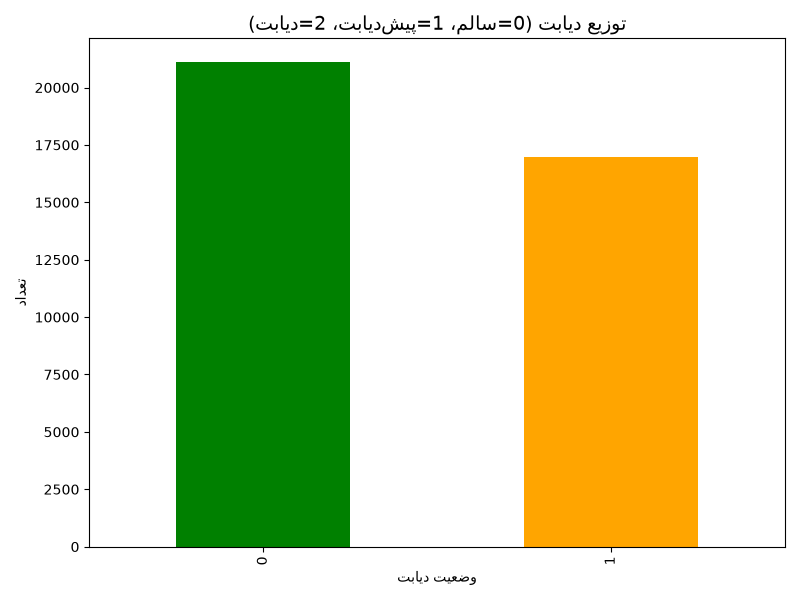
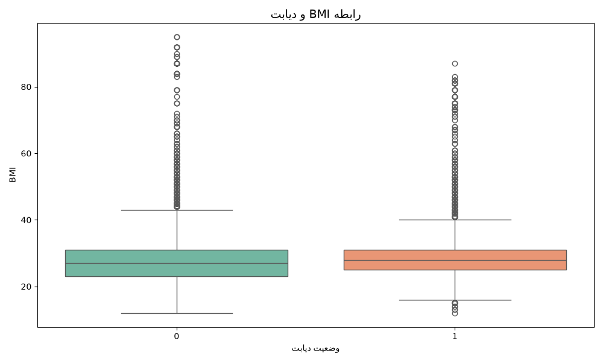
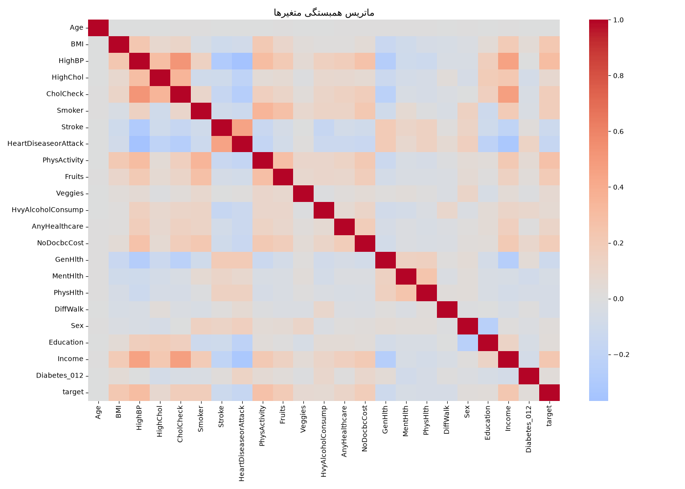

# Health Data Analysis — CDC Diabetes Health Indicators

## Project Description
Exploratory data analysis (EDA) of diabetes health indicators using the CDC Behavioral Risk Factor Surveillance System (BRFSS) dataset. This project includes data exploration, visualization, and correlation analysis between key health variables.

## Objectives
- Work with real-world health data
- Perform exploratory data analysis (EDA) with Python
- Create analytical visualizations
- Prepare a foundation for advanced health data projects

## Dataset
- **Source:** CDC Diabetes Health Indicators (Hugging Face)
- **Rows:** 38,052
- **Columns:** 23
- **Key variables:** Age, BMI, HighBP, HighChol, Smoker, Stroke, HeartDiseaseorAttack, PhysActivity, Diabetes_012, target

## Tools & Libraries
- Python 3.13
- pandas
- numpy
- matplotlib
- seaborn
- pyarrow

## Visualizations

### Age Distribution


### Diabetes Distribution


### BMI vs Diabetes


### Correlation Matrix


## How to Run

1. Install Python 3.13
2. Install required libraries:
```bash
pip install pandas numpy matplotlib seaborn pyarrow
```
3. Run the script:
```bash
python EXPLORE.PY
```
